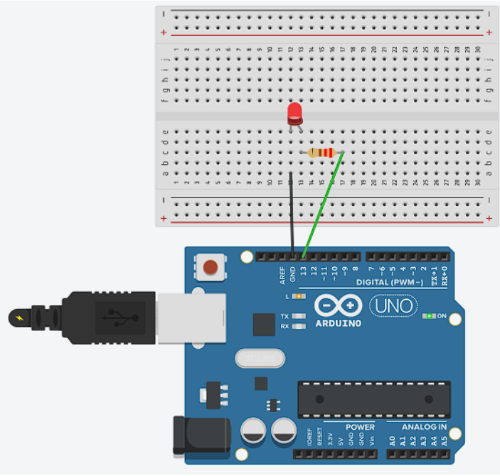

# P_Mecatronica

Este repositorio incluye cada práctica desarrollada a lo largo del curso.

## Contenido

- [P_Mecatronica](#p_mecatronica)
  - [Contenido](#contenido)
  - [Practica 01](#practica-01)
  - [Practica 02](#practica-02)

## Practica 01

El objetivo de esta práctica es el conecer el sistema operativo linux en su distro Ubuntu y la terminal de comandos. Al igual aprender a utilizar el sitema de control de versiones de Git y Github.

En resumen aprendimos a crear directorios y archivos, al igual que modificarlos desde la termianl. El objetivo final era lograr la siguiente captura del comando _tree_.

El resultado de la actividad se puede ver [aquí](/Practica01/), al final de cuentas son los directorios creados.

## Practica 02

Esta práctica tiene como objetivos:

- Conocer las plataformas, herramientas y ambientes más comunes para el desarrollo de sistemas mecatrónicos basados en microcontroladores.
- Identificar los elementos básicos de la arquitectura de un microcontrolador digital.
- Identificar  los  módulos  que  componen  a  la  tarjeta  de  desarrollo  Arduino  y  sus interconexiones básicas.
- Realizar una comparativa entre las implementaciones en código de bajo y alto nivel, destacando las ventajas y pertinencia de cada una de las estrategias de programación de microcontroladores.

La primera actividad fue respecto a armar el siguiente circuito:

